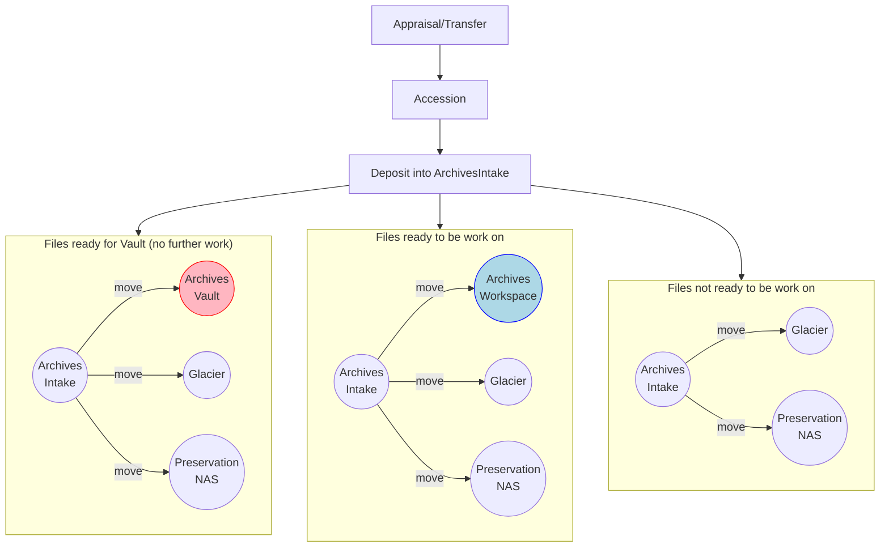

# laughing-carnival

```mermaid
flowchart TD
  subgraph 4a["Files ready for Vault (no further work)"]
    direction LR
    4a1(("`Archives
    Intake`")) -- move --> 4a2(("`Archives
    Vault`"))
    4a1 -- move --> 4a3((Glacier))
    4a1 -- move --> 4a4(("`Preservation
    NAS`"))
  end
  subgraph 4b[Files ready to be work on]
    direction LR
    4b1(("`Archives
    Intake`")) -- move --> 4b2(("`Archives
    Workspace`"))
    4b1 -- move --> 4b3((Glacier))
    4b1 -- move --> 4b4(("`Preservation
    NAS`"))
  end
  subgraph 4c[Files not ready to be work on]
    direction LR
    4c1(("`Archives
    Intake`")) -- move --> 4c2((Glacier))
    4c1 -- move --> 4c4(("`Preservation
    NAS`"))
  end
  1[Appraisal/Transfer] --> 2[Accession]
  2 --> 3[Deposit into ArchivesIntake]
  3 --> 4a
  3 --> 4b
  3 --> 4c
  style 4a2 fill:lightpink,stroke:red
  style 4b2 fill:lightblue,stroke:blue
```
